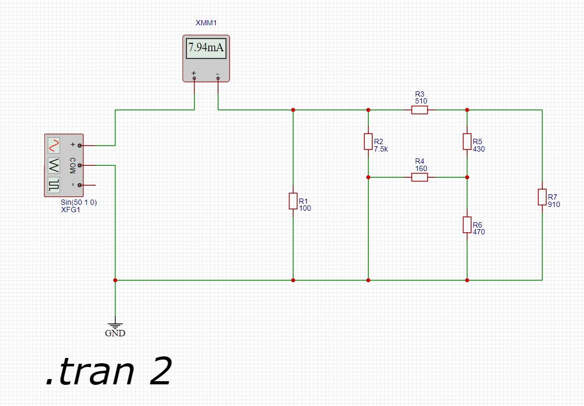
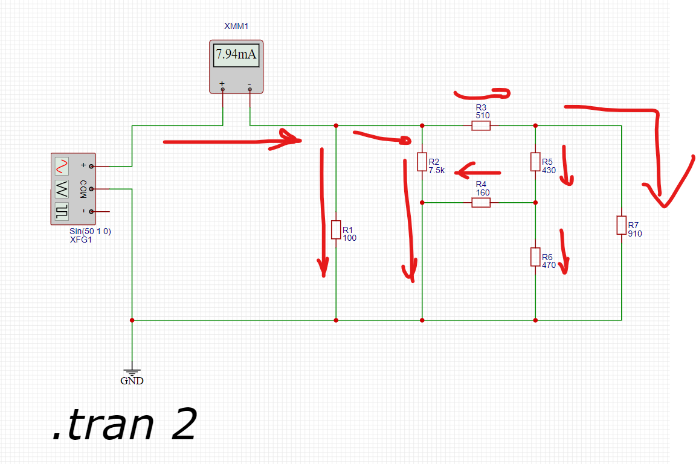
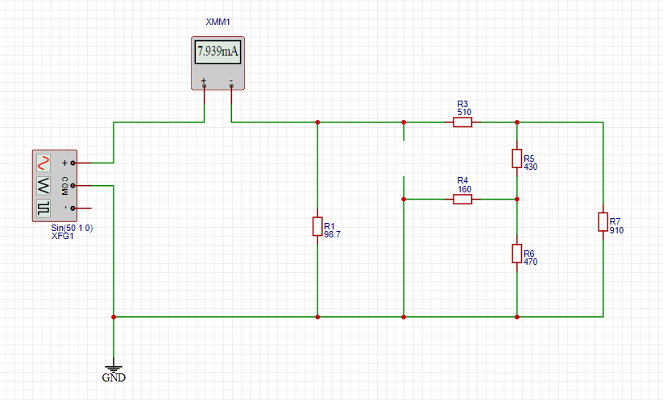
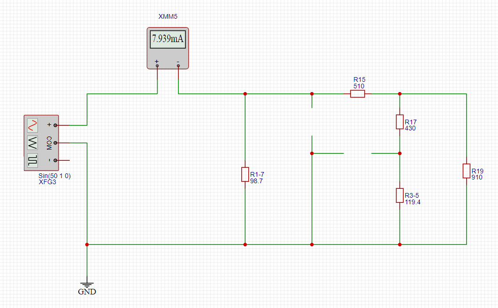
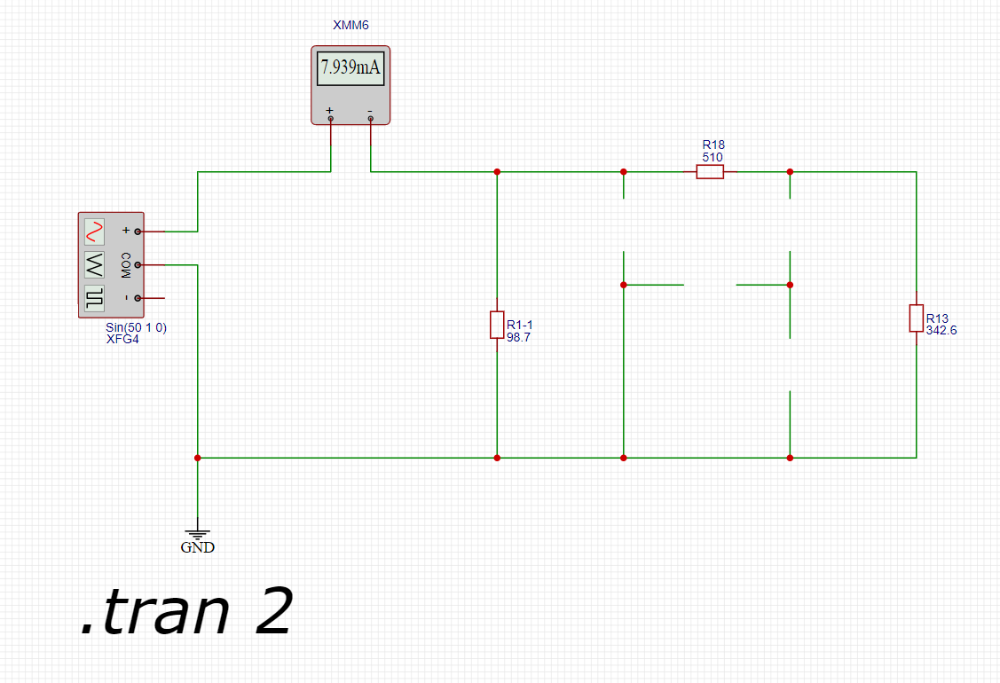
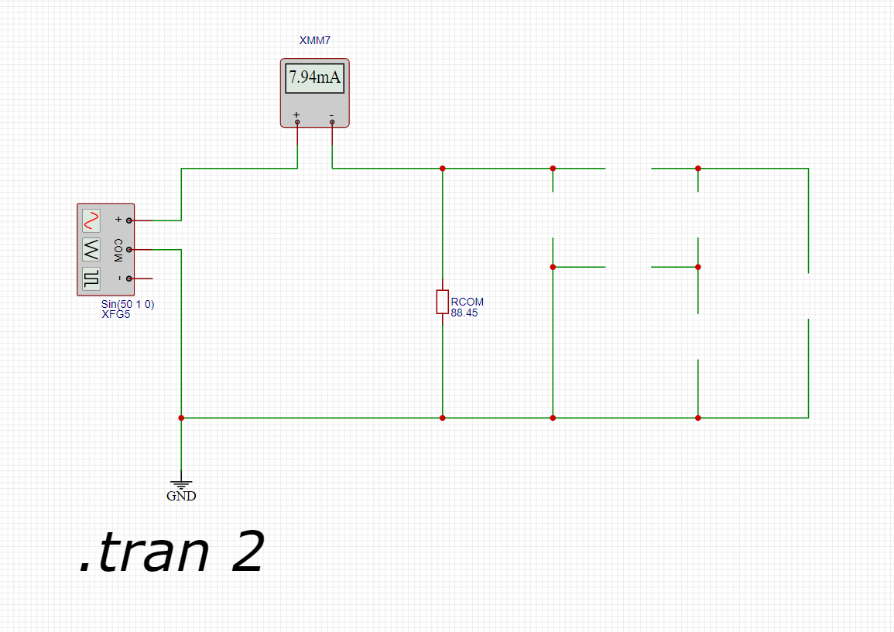

На первом этапе настроим схему и подключим амперметр на одном из входов генератора для контроля силы тока всей цепи.

Схема имеет следующий вид

Рассмотрим как протекает ток по сопротивлениям с целью выбора кандидатов для сокращения и замены группы сопротивлений одним

## Шаг 1

Расчитаем общее сопротивление группы сопротивлений R1 и R7, так как они являются параллельными по отношению друг к другу.

Расчитаем по формуле сопротивления цепей с параллельным соединением:

R1-7 = 1/(1/R1+ 1/R7) = 1 / (1/100 + 1/7500) = 98.7 Ом.

Проведем замену и тест сети.

В ходе теста за счет округления мы получили отклонения от изначальной силы тока в цепи на 0.01, что составляет менее 1% от заданного значений

## Шаг 2

Расчитаем общее сопротивление группы R3 и R5 по формуле цепей с параллельным соединением:

R3-5 = 1 / ( 1/160 + 1/470) = 119,4 Ом.

Тестируем сеть с примененными изменениями

# Шаг 3

Расчитываем общее сопротивление для участка цепи с сопротивлениями R4, R6 и новым сопротивлением R3-5

R4 и R3-5 соединены последовательно, а значит расчет общего сопротивления будет проводится по формуле сопротивления цепи для последовательных соединений.
Вышеуказанная группа подключена параллельно сопротивлению R6, т.е. будем использовать фомулу примененнуюна шагах 1-2.
Общая фомула будет иметь вид

R3-4-5-6 = 1 / (1 / R6 + 1 / (R3-5 + R4)) = 1 / ( 1 / 910 + 1 / (119,4 + 430)) = 342,6 Ом

Тестируем сеть с примененными изменениями

# Шаг 4 (заключительный)

Расчитываем сопротивление для оставшегося параллельного участка имеющего ветвь с последовательным соединением.

Соттветственно применяем фомулу аналогично шагу 3 для имеющихся значений.

Rкон = 1 / ( 1/ 98.7 + 1 / (342.6 + 510)) = 88,5 Ом

Тестируем сеть с примененными изменениями

