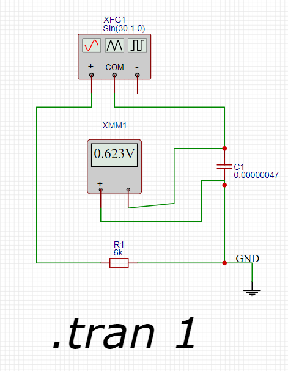

Цепь состоит из генератора, резистора R1 и конденсатора C1. Напряжение на выходе измеряется после конденсатора.

Известные параметры:
- Амплитуда напряжения генератора E1 U = 1 В
- Частота генератора E1 f = 30 Гц
- Емкость конденсатора C1 C = 470 нФ = 470 * 10^-9 Ф = 0.000000470 Ф
- Напряжение на конденсаторе UC = 0,653 В

## Расчет реактивного сопротивления конденсатора

Реактивное сопротивление конденсатора определяется по формуле:

XC = 1 / 2 * pi * f * C

Подставим известные значения:

XC = 1 / 2 * pi * 30 * 0.000000470 ~ 11288 Ом

## Расчёт полного сопротивления цепи

Полное сопротивление (импеданс) цепи Z можно найти через закон Ома для переменного тока:

Z = UI

где I – ток в цепи. Так как напряжение на конденсаторе составляет часть от общего напряжения, то можно выразить полное сопротивление через отношение напряжений:

Z = XC * sin(phi)

где phi – угол сдвига фаз между напряжением и током. Поскольку у нас есть отношение напряжений, мы можем использовать теорему Пифагора для нахождения угла phi:

sin(phi) = UC * U0 = 0,623 * 1 = 0,653

Отсюда находим phi:

phi = arcsin(0,653) = 0.711 рад = 40,73 грд

Теперь найдём полное сопротивление:

Z = 11288 / sin(40,73) = 17313 Om

## Расчёт активного сопротивления резистора

Так как общее сопротивление состоит из суммы активного сопротивления резистора и реактивного сопротивления конденсатора, то активное сопротивление резистора равно разнице между полным сопротивлением и реактивным сопротивлением конденсатора:

R1 = Z - XC = 17313 - 11288 = 6025 или приблизительно 6 кОм.

Результат вычислений проверяем на стенде:

