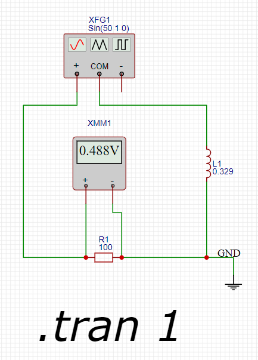

Для решения задачи мы воспользуемся законами Кирхгофа и формулами для расчета импеданса элементов цепи переменного тока.

## Расчет напряжения элементах схемы

Напряжение на резисторе U(R1) составляет 0.491 В. 
Поскольку цепь последовательная, ток одинаков во всех её частях. 
Тогда полное напряжение согласно второго закона Кирхгофа E1 равно сумме напряжений напряжений на каждом элементе цепи:

E1 = U(R1) + U(L1)

где U(L1) – напряжения на индуктивном элементе. Так как нам известно, что U(R1) = 0.491 В, то U(L1) будет равно разнице между полным напряжением и напряжением на резисторе:

U(L1) = E1 - U(R1)

Так как амплитуда источника равна 1 В, получаем:

U(L1) = 1 - 0.491 = 0.509 В

## Расчет силы тока

Для расчета силы тока воспользуемся законом Ома.

I = U / R

где, I - сила тока, U - напряжение на резисторе R1, R - сопротивление резистора

I = 0.491 / 100 = 0.00491 А.

Сила тока во всех элементах сети будет одинаковой, так как используется последовательное подключение элементов.

## Расчет индуктивности

Зная напряжение на индуктивности L1 и силу тока в цепи определим реактивное сопротивление индуктивности используя закон Ома.

XL1 = U(L1) / I = 0.509 / 0.00491 ~ 103.666 Ом.

Теперь подставим найденное значение в формулу расчета индуктивности

L1 = XL1 / 2 * pi * f = 103.666 / 2 * pi * 50 = 0.32997 Гн

Результат вычислений проверяем на стенде:

