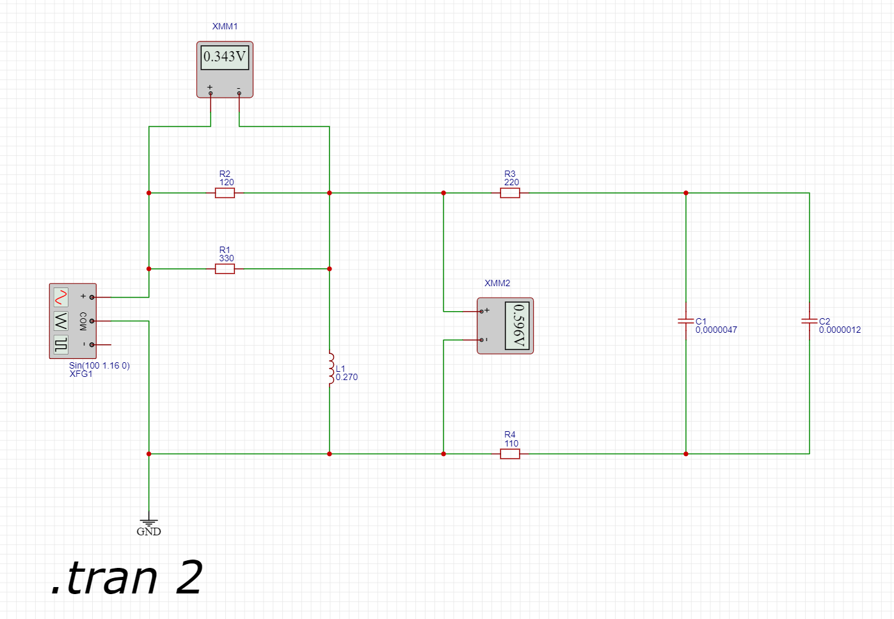
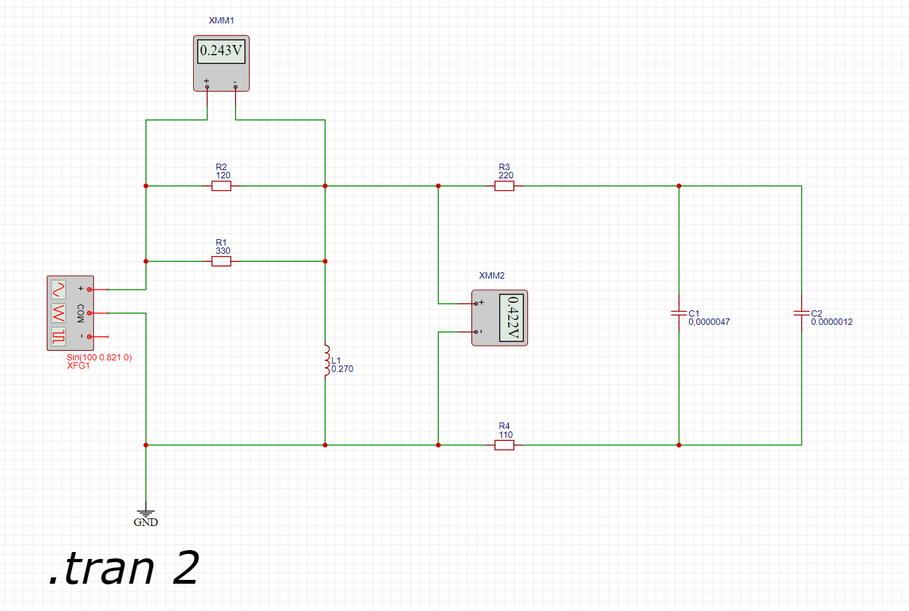

## Анализ цепи

Сеть состоит из двух последовательно соединенных участков:
Участок 1: Параллельное соединение сопротивлений R1 и R2
Участок 2: Индуктивность L1 и подключенного к нему участка из последовательно соединенных сопротивления R3, двух соединенных параллельно емкостей C1 и С2, и сопротивления R4

Нам необходимо расчитать амплитуду и частоту генерации сигналов для соблюдения параметров сети а именно напряжения на вольтметре V1 (измерение напряжения на сопротивлении R2) 0.243 В и вольтметра V2 (измеряющеми напряжение на участке состящем из 2х сопротивлений и 2х конденсаторов) 0.578 В.

## Расчитываем эквивалентное сопротивление на участке 1.

Определяем силу тока на участке 1.
Для этой цели определяем общее сопротивление участка. 

R(уч1) = 1 / ( 1 / R1 + 1 / R2) = 88 Ом.

## Расчитываем импеданс (полное сопротивление) участка 2

### Расчитываем реактивное сопротивление катушки L1

Реактивное сопротивление катушки индуктивности на частоте $f$ равно:

XL = 2\pi * f * L = 2 * pi * 100 Гц * 0.27 Гн = 169.64 Ом

### Расчитываем емкость эквивалентного конденсатора и его реактивное сопротивление

Электроёмкость батареи конденсаторов равна сумме электроемкостей отдельных конденсаторов

Сэкв = С1 + С2 = 4.7 + 1.2 = 5.9 мкФ = 0.0000059 Ф

Реактивное соппротивление конденсатора расчитывается по формуле

XC = 1 /  (2 * pi * f * C) = 1 / (2 * pi * 100 * 0.0000059) = 269.754 Ом

### Полное сопротивление второй ветви
Вторая ветвь содержит последовательное соединение R3, XC (реактивное сопротивление конденсаторов) и R4. Суммарное сопротивление этой ветви:

Z2 = R3 + XC + R4 = 220 + 269.8 + 110 = 599.8 Ом

### Импеданс участка 2

Zэкв = 1 / ( 1 / XL + 1 / Z2) = 1 / ( 1 / 599.8 + 1 / 169.64) = 130.19 Ом.

## Импеданс полной цепи

Цепь состоит из двух последовательно соединённых участков, поэтому общее сопротивление цепи равно сумме сопротивлений этих участков.

Zо = Zэкв + R(уч1) = 88 + 130.19 = 218.19 Ом

# Расчет напряжения сети и амплитуды переменного тока

Uобщ = Uуч1 + Uуч2 = 0.243 + 0.578 = 0.821 В

Так как измерительные приборы показывают среднеквадратичное значение напряжения для определения напряжения необходимо использоватиь формулу

А = Uобщ * sqrt(2) = 0.821 * sqrt(2) = 1,161 В

## Тест результатов

Показания приборов при значении амплитуды 1.16 В 

Показания приборов при значении амплитуды 0.821 В

Напряжение на участке 2 равно 0.578 В. Импеданс участка равен 130.19 Ом. Используя закон Ома найдем ток в данном участке цепи.

I = U / Z = 0.578 / 130.19 = 0.004439 А

Так как участки соединены последовательно ток на участке 2 равен току на участке 1 (первый закон Кирхгофа)

Расчитываем напряжение на 1 участке согласно закону Ома

U1уч = 0.004439 * 88 = 0.39 В (Что ближе соответствует результатам тестирования схемы в случае А = 1.16 В)

**Видимо в условии задачи меется ошибка!!!**