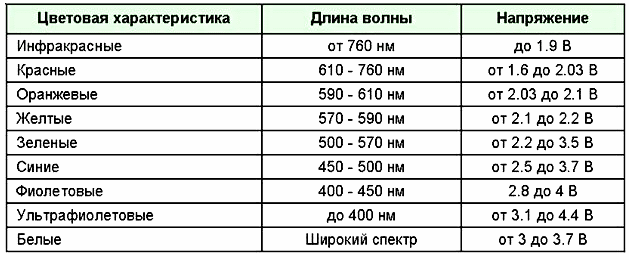
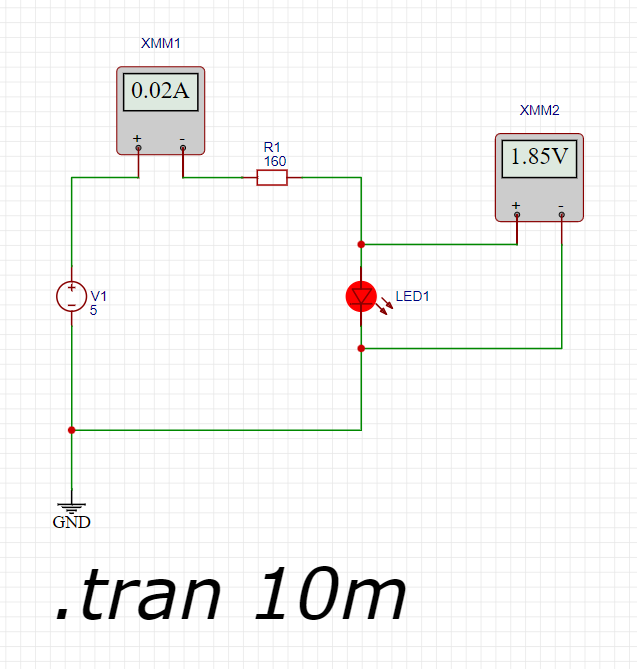

## Падение напряжения на светодиоде

Диод – полупроводниковый прибор, имеющий 2 вывода для подключения. Изготавливается, упрощенно говоря, путем соединения 2х полупроводников с разным типом примеси, их называют донорной и акцепторной, n и p соответственно, поэтому диод содержит внутри pn-переход.
Рассмотрим свойства диода, самые очевидные:

    От анода к катоду, такое направление называется прямым, диод пропускает ток.
    От катода к аноду, в обратном направлении, диод ток не пропускает. (Теоретически)
    При протекании тока, в прямом направлении, на диоде падает некоторое напряжение.

Падение напряжения на светодиодах ависит в основном от цвета светодиода. Начиная от красного, падение напряжения которого составляет в среднем 1,8 В, и заканчивая белым или синим светодиодом, падение у которых около 3,5 В. Впрочем, у невидимого спектра эти значения шире.

\
Источник habr.ru

По сути падение напряжения здесь – минимальное напряжение зажигания диода. При меньшем напряжении, у источника питания, тока не будет и диод просто не загорится.

Для дальнейших расчетов будем использовать красный светодиод с падением напряжения 1.8 вольта

## Опрделение падения напряжения на резисторе.

Исходя из того что источник питания дает напряжение 5 В, а элементы подключены последовательно, то падение напряжения на резисторе должно составлять разницу между напряжением источника и падением напряжения на светодиоде (вторй закон Кирхгофа):

U(R1) = Uобщ - U(VD1) = 5 - 1.8 = 3.2 В

## Определяем номинал резистора

По условию задачи сила тока должна составлять 20 мА или 0.02 А. С учетом последовательности соединения электроприборов сила тока не изменяется на всем протяжении течения тока.

Сопротивление резистора (закон Ома) должно составлять 3.2 В / 0.02 А или 160 Ом.

## Проверка полученных значений

