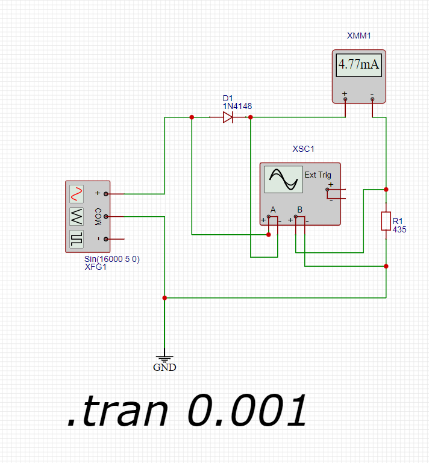
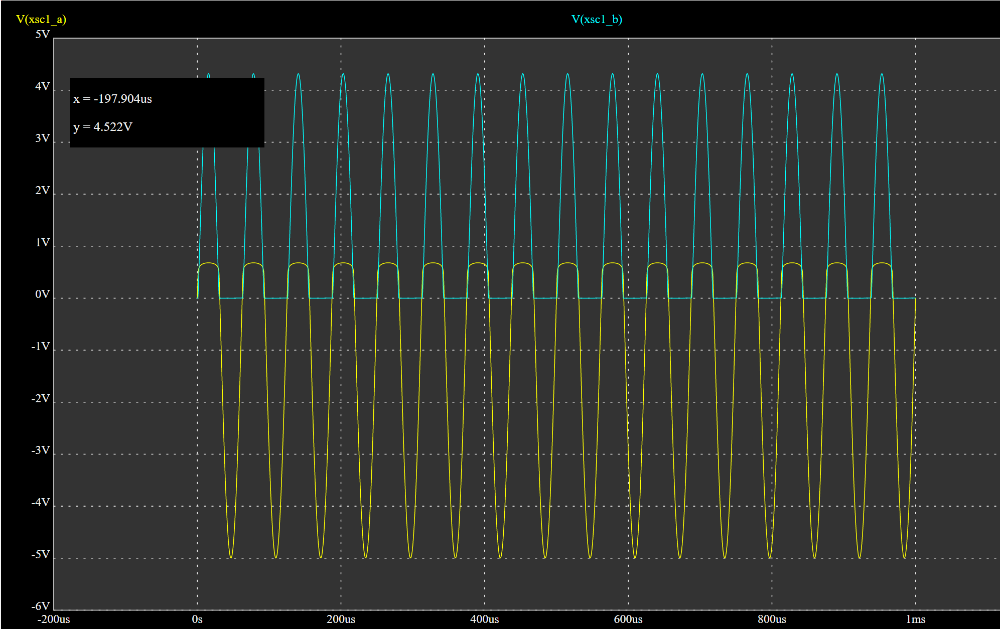

## Исследуем схему.

Диод 1N4148 является кремниевым диодом, который проводит ток только в одном направлении. Это означает, что при положительной полуволне синусоиды он будет открыт, а при отрицательной – закрыт. Таким образом, через цепь будет проходить только половина синусоидального сигнала.
Согласно документации падение напряжения на диоде 1N4148 составляет 0.6-0.7 В при токе (5 мА) и до 1 В (при токе 100 мА).

## Падение напряжения на диоде и напряжение на резисторе

Ur1 = Uf - Uvd1 = 5 - 0.65 = 4.35 В

Учитываем однополупериодное выпрямление тока.

Uhr1 = Ur1/2 = 4.35 / 2 = 2.175 В

## Расчитываем сопротивление резистора.

R = 2.175 * 0.005 = 435 Ом

## Осцилограмма

### Осциллограмма канала A (вход/выход диода):
- Время 15.6 мкс: Напряжение 0.68 В
- Время 49.179 мкс: Напряжение -4.998 В

### Осциллограмма канала B (резистор):
- Время 15.6 мкс: Напряжение 4.318 В
- Время 49.179 мкс: Напряжение 0 В

### Анализ

1. Время 15.6 мкс:
   - Канал A: Напряжение 0.68 В. Это значение близко к прямому падению напряжения на диоде 1N4148 при прохождении тока. Это говорит о том, что диод открыт и проводит ток.
   - Канал B: Напряжение 4.318 В. Напряжение падает на резисторе

2. Время 49.179 мкс:
   - Канал A: Напряжение -4.998 В. Это отрицательное значение говорит о том, что диод закрыт и не проводит ток.
   - Канал B: Напряжение 0 В. Отсутствие напряжения на резисторе подтверждает, что ток через него не проходит.