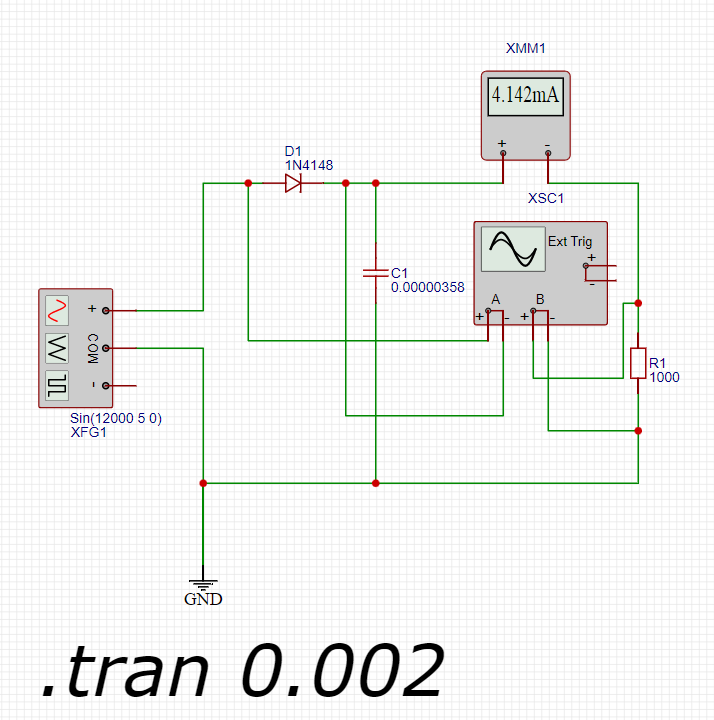

Для решения задачи необходимо понять, как происходит процесс выпрямления переменного тока через диод и какие факторы влияют на пульсации напряжения на выходе схемы.

### Анализ работы схемы

Диод пропускает ток только в одном направлении, поэтому сигнал после него будет представлять собой положительные полуволны синусоиды. Конденсатор будет заряжаться до максимального (амплитудного) значения напряжения, а затем разряжаться через резистор, пока снова не поступит следующая положительная полуволна.

### Расчет значения напряжения на конденсаторе и сопротивлении

Максимальное напряжение на конденсаторе равно амплитудному значению входного сигнала минус падение напряжения на диоде (обычно около 0,7 В для заданного диода). Таким образом, максимальное напряжение на конденсаторе:

Vc1(amp) = A - VD = 5 В - 0,7 В = 4,3 В

где A – амплитуда входного сигнала, VD – падение напряжения на диоде (берем из документации).

### Расчет пульсаций

Пульсации напряжения на нагрузке зависят от емкости конденсатора и сопротивления нагрузки. Чем больше емкость, тем меньше будут пульсации, так как конденсатор сможет дольше удерживать заряд между импульсами заряда.

Допустимая пульсация напряжения составляет 0,1 В. Это означает, что минимальное напряжение на конденсаторе должно быть:

Vс1{min} = 4,3 В - 0,1 В = 4,2 В

Пульсации напряжения на конденсаторе в установившемся режиме для однополупериодного выпрямителя определяются по формуле:

DeltaV = Ic1 / f * C

где, Ic1 - ток на нагрузке (конденсатор), f - частота сигнала, С - емкость конденсатора.

### Расчет тока через нагрузку

Ic1 = Vc1 / Rc1 = 4.3 / 1000 = 4.3 мА или 0.0043 А

### Определение емкости конденсатора

С = Ic1 / f * DeltaV = 0.0043 / 12000 * 0.1 = 3,58 мкФ

## Осцилограмма

## Выбор стандартного значения:

Ближайшее стандартное значение емкости конденсатора — 4,7 мкФ.

Проверяем значение пульсации со стандартной емкостью

DeltaV = 0.0043 / 12000 * 0.0000047 = 0.076 В

Что находится в пределах допустимого значения.