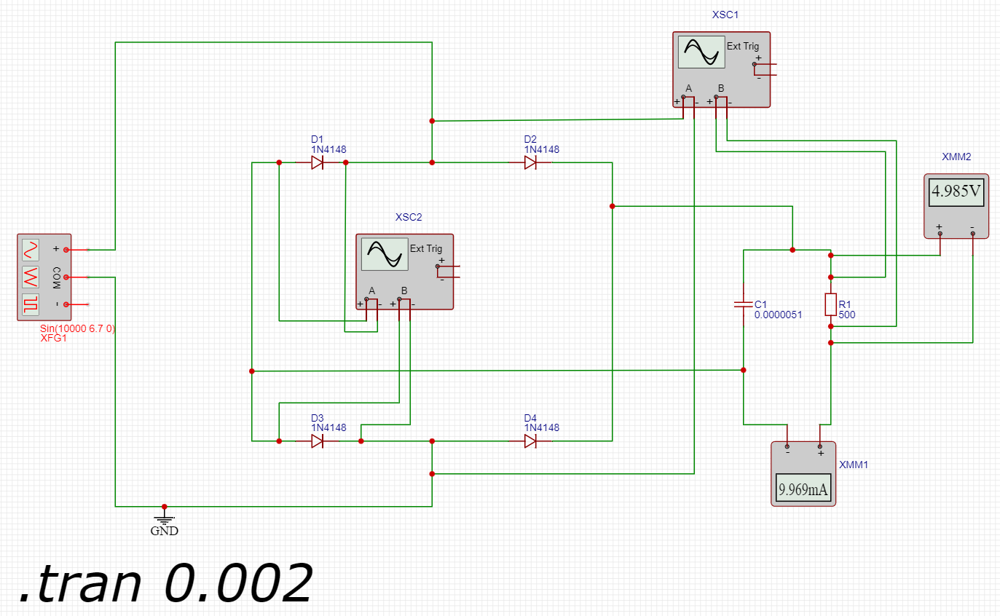
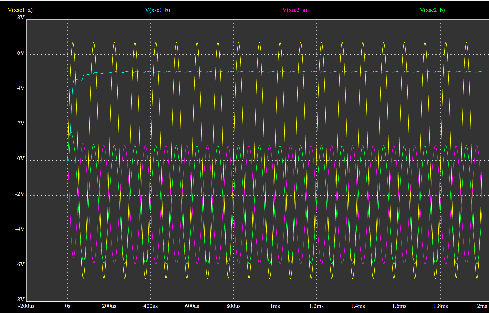

## Анализ схемы.

Имеем двухполупериодный выпрямитель с диодным мостом. На вход подается синусоидальный сигнал с частотой 10 кГц. На выход подключена нагрузка (резистор) и параллельно к нему конденсатор.

## Расчет параметров нагрузки

На нагрузке должно быть напряжение 5 В с допустимой пульсацией 0.1 В. 

Vmax = Vнагр  = 5 В.
Vmin = Vнагр - DeltaV = 4.9 В.

Ток на нагрузке должен составлять 10 мА.
Сопротивление нагрузки при заданных значениях должно быть следующим:

R = Vнагр / Iнагр = 5 / 0.01 = 500 Ом.

## Расчет параметров конденсатора

Пульсации напряжения на нагрузке зависят от емкости конденсатора и сопротивления нагрузки. Чем больше емкость, тем меньше будут пульсации, так как конденсатор сможет дольше удерживать заряд между импульсами заряда.
На выходе диодного моста сигнал имеет удвоенную по сравнению с однополупериодным выпрямителем частоту. 
В этом случае пульсации напряжения на конденсаторе в установившемся режиме для двухполупериодного выпрямителя определяются по формуле:

DeltaV = Ic1 / 2 * f * C 

где, DeltaV - пульсация напряжения, Ic1 - ток нагрузки, f - частота сигнала, С - емкость конденсатора.

С = Ic1 / 2 * f * DeltaV = 0.01 / 2 * 10000 * 0.1 = 5 мкФ.

Ближайшая стандартная емкость конденсатора (ряд E24, допуск +-5%) составляет 5.1 мкФ

Реактивное сопротивление конденсатора определим по формуле Xc= 1 / 2pi * f * C

Xc = 1 / 2pi * 20000 * 0.0000051 = 1.56 Ом.

## Расчет скорости разряда конденсатора

Так как на нагрузку подается измененный сигнал (только верхние полуволны синусоидального сигнала), то заряд конденсатора будет проводится на удвоенной от исходной частоте.
Период между пиками составляет T = 1/f = 1/20000 = 0.00005 секунды.

Изменение заряда на конденсаторе DeltaQ можно выразить формулой через изменение напряжения DeltaV и емкость C:

DeltaQ = C * DeltaV

где DeltaV = 0.1 В (допустимая пульсация напряжения).

DeltaQ = 0.0000051 * 0.1 = 0.00000051 Кл

Время разряда Deltat можно найти, поделив изменение заряда на ток нагрузки:

Deltat = DeltaQ / I

I = 0.01 А (ток нагрузки).

Deltat = 0.00000051 / 0.01 = 0.000051 секунды.

Сравним время разряда с половиной периода входящего сигнала (так как конденсатор разряжается только в течение одной половины периода синусоидального сигнала):
T < Deltat, что означает, что конденсатор разряжается неполностью.

## Расчет силы тока в участке цепи с нагрузкой и конденсатором

Конденастор компенсирует пульсации напряжения, и ток через него связан с изменением напряжения. Ток через кондженсатор можно рачитать по формуле 

Ic = C * DeltaV / DeltaQ

После диодного моста частота пульсации удваивается, т.е равна 20 кГц.
Период пульсации расчитан ранее = 0.00005 сек
Соответственно Deltat = можно оченить как половину периода что равно 0.000025 сек

Ток через конденсатор 
Ic = 0.0000051 * 0.1 / 0.000025 = 20.4 мА

Суммарная сила тока будет складываться из силы тока проходящего через конденсатор и нагрузку

Iуц = 20.4 + 10 = 30.4 мА

## Расчет амплитуды входного сигнала.

Падение напряжения после выпрямления составляет 5 В. Сигнал до попадания на нагрузку одновременно проходит через 2 диода.
Падение напряжения на диоде при токе нагрузки более 20 мА составляет от 0.08 - 0.9 В.
Можем получить напряжение подаваемое на вход выпрямителя.

Vвх = Vнагр + 2 * VD = 5 + 2* 0.85 = 6.7 В.

## Результаты тестирования схемы 

## Осцилограмма

