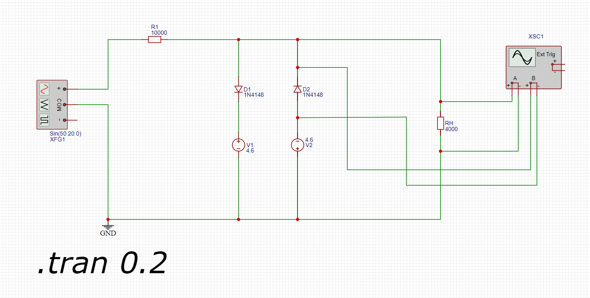
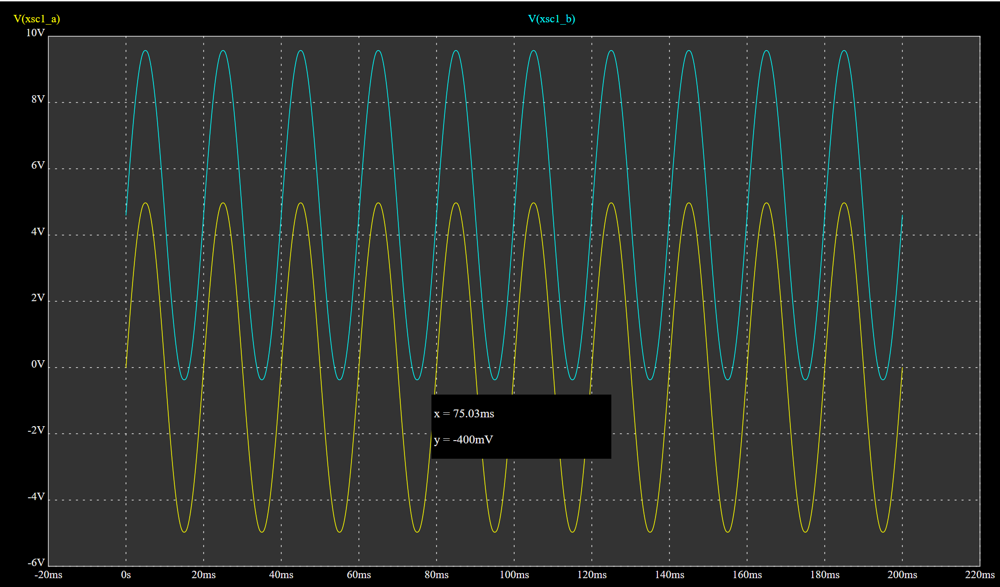

## Анализ схемы

Для расчёта параметров схемы с амплитудным ограничителем на диодах, рассмотрим заданные условия.

Диоды VD1 и VD2 подключены встречно-параллельно и параллельно нагрузке RH​.
Нагрузка RH = 4 кОм, амплитуда напряжения на нагрузке Urh = 5В.
Генератор синусоидального сигнала E1E1 с частотой 50 Гц50Гц и амплитудой 20 В.
Опорные напряжения Eon1​ и Eon2

## Выбор источников опорного напряжения.

Источник опорного напряжения должен обеспечивать **постоянное** напряжение (DC), а не переменное (AC). Это важно, потому что опорное напряжение используется для задания фиксированного уровня, на котором происходит ограничение сигнала.

Почему именно постоянное напряжение?

Ограничение сигнала:

Опорное напряжение задаёт уровень, выше или ниже которого сигнал не должен выходить. Если бы опорное напряжение было переменным, оно само бы изменялось, и ограничение стало бы невозможным.

Стабильность:

Постоянное напряжение обеспечивает стабильный уровень ограничения. Например, если вы хотите ограничить сигнал на уровне 5 В, опорное напряжение должно быть строго 5 В (или −5 В для отрицательного полупериода).

Работа с диодами или стабилитронами:

Диоды и стабилитроны работают с постоянным напряжением. Например, стабилитрон поддерживает на своих выводах постоянное напряжение стабилизации UZ​, а диод открывается при достижении постоянного напряжения Uon​.

Что будет, если использовать переменное напряжение?

Если попытаться использовать переменное напряжение в качестве опорного:

Уровень ограничения будет постоянно меняться, что сделает схему неработоспособной.
Диоды или стабилитроны не смогут корректно ограничивать сигнал, так как их работа основана на фиксированных уровнях напряжения.

В качестве элементов, обеспечивающих опорное напряжение в схемах амплитудных ограничителей, могут использоваться следующие компоненты:

**Стабилитроны (Zenner Diods):**

    Стабилитроны — это основные элементы для создания опорного напряжения. Они работают в режиме обратного пробоя, обеспечивая стабильное напряжение на своих выводах.
    Напряжение стабилизации UZ​ стабилитрона выбирается в зависимости от требуемого уровня ограничения. Например, если нужно ограничить сигнал на уровне 5 В, используется стабилитрон с UZ=5 В.
    Стабилитроны могут использоваться как для одностороннего, так и для двустороннего ограничения (включаются встречно-параллельно).

**Источники опорного напряжения (Reference Voltage Sources):**

    Это специализированные интегральные схемы (например, TL431, LM4040), которые обеспечивают высокоточное и стабильное опорное напряжение.
    Такие источники используются в прецизионных схемах, где требуется высокая точность ограничения.

**Резисторные делители напряжения:**

    Если опорное напряжение формируется из внешнего источника постоянного или выпрямленного тока, можно использовать резисторный делитель напряжения для получения нужного уровня.
    Например, если есть источник напряжения 10 В, то с помощью делителя можно получить 5 В для использования в качестве опорного.
​
**Батареи или аккумуляторы:**

    В некоторых случаях (например, в портативных устройствах) в качестве опорного напряжения могут использоваться батареи или аккумуляторы. Однако это менее распространённый подход из-за нестабильности напряжения таких источников.

***Для упрощения в схему подключены два источника постоянного тока***

## Расчёт резистора R1:

Ток через нагрузку RH​:

Напряжение на нагрузке URH=5 В, сопротивление RH=4 кОм. Ток через нагрузку:

IRH = URH / RH=5 В / 4 кОм = 1.25 мА.

Падение напряжения на резисторе R1R1:

Резистор R1R1 ограничивает ток через диоды и нагрузку. Напряжение на резисторе R1R1 равно разности между входным напряжением и напряжением на нагрузке:

UR1 = Uin − URH = 20 В−5 В = 15 В.

Сопротивление резистора R1:

Ток через резистор R1 равен току через нагрузку IRH=1.25 м. Тогда сопротивление R1:
R1 = UR1 / IRH = 15 В / 1.25 мА = 12 кОм.

## Расчет параметров опорного напряжения.

Значение опорного напряжения в данном случае необходимо расчитывать исходя из сложения напряжения открытия диода при расчитанной силе тока на нагрузке и напряжения источника опорного напряжения

Падение напряджения на диоде при токах менее 2 мА составляет 0.3-0.4 В. Для данного расчета используем значение 0.4 В.

Опорное напряжение необходимо определить как Uнагр - Uvd = 5 - 0.4 = 4.6 D В.

Для данной схемы используем 2 источника постоянного тока с напряжением 4.6 В. При данном способе реализации амплитудного ограничителя она обеспечит необходимое значение амплитуды на нагрузке.

## полученная схема

## Осцилограмма результатов проверки схемы

