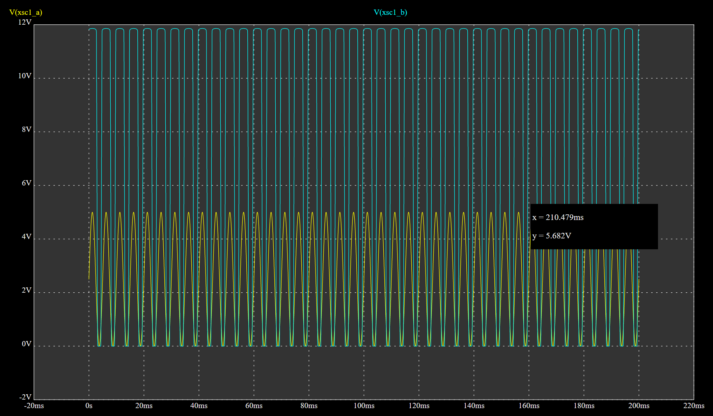

## Анализ схемы и назначение

## Расчет параметров управляющего сигнала на E1

Согласно условию задачи, период управляющего сигнала составляет 5 мс. Частота сигнала связана с периодом следующим соотношением:
f = 1 / T

где, T = 5 мс = 0.005 с — период сигнала.

Подставляем значения:
f = 1 / 0.005 = 200 Гц

Так как напряжение нижнего уровня 0 В, напряжение верхнего уровня 5 В, то точка смещения сигнала будет являться средним значением между этими значениями.

Uсмещ = (0 В + 5 В) / 5 = 2.5 В

Для достижения значений напряжения нижнего уровня 0 В и напряжения верхнего уровня 5 В нам необходимо равно удаляться от значения смещения.
Амплитуда сигнала должна составлять 2.5 В, что позволит соответственно получить исходные значения нижнего и верхнего уровней.

**Осцилограмма сигнала генратора импульсов**

## Параметры транзистора 2N2222

Согласно документации на транзистор 2N2222 (NPN), его основные параметры:

Коэффициент усиления по току (hFE или β): обычно находится в диапазоне 35–100 (зависит от конкретного экземпляра и условий работы). Для расчётов возьмём минимальное значение β = 35.

Напряжение насыщения коллектор-эмиттер (VCE_sat): около 0.2–0.3 В при токе коллектора в несколько сотен миллиампер.

Напряжение база-эмиттер V_be = 0.6 - 0.7 В

Максимальный ток коллектора (IC_max): до 800 мА.

## Расчет тока на нагрузке.

Нагрузка RH имеет сопротивление 100 Ом и питается от источника E2 с напряжением 12 В. При этом нужно учесть, что часть напряжения источника используется для насыщения коллектор-эмитер, т.е. с учетом последовательности соединения вычитает данное значение из напряжения источника.

Таким образом ток нагрузки мы можем расчитать исходя из формулы (закон Ома)

Iнагр = (Ve2 - VCE_sat) / Rнагр

Для расчетов мы будем использовать значение VCE_sat = 0.2 В.

Iнагр = (12 - 0.2) / 100 = 11.8 / 100 = 118 мА
Максимальный ток коллектора (IC_max): до 800 мА. Значение 118 мА укладывается в допустимый предел.

**Осцилограмма напряжения на нагрузке RH и генератора сигналов E1**

## Расчет минимального тока базы

Транзистор работает в режиме насыщения, когда ток коллектора достигает требуемого значения. Для этого необходимо обеспечить достаточный ток базы. Формула для расчёта тока базы:
Ib=Ic/β​​

Где:
    Ic=Iнагр=118 мА — ток коллектора.
    β=35 — минимальный коэффициент усиления по току.

Подставляем значения:
Ib=118/35≈3.37 мА

Таким образом, минимальный ток базы должен быть не менее 3.37 мА.

Данное значение необходимо для расчета сопротивления R1.

## Расчет сопротивления R1

Задача резистора R1 не допустить появления короткого замыкания и обеспечить необходимое падение напряжения до значения падения напряжения база-эмитер

Исходя из того, что мы имеем последовательное соединение потребителей падение напряжения на сопротивлении R1 Должно быть разницей между напряжение верхнего уровня (5 В) и напряжением база-эмитер транзистора

Ur1 = Usig - Ube = 5 - 0.7 = 4.3 В.

Минимальный ток базы должен составлять 3.37 мА.

Исходя из закона Ома находим значение сопротивления R1

R1 = Ur1 / Ib = 4.3 / 0.00337 = 1275 Ом.

Ближайший стандартный номинал 1200 Ом.

**Проверка насыщения транзистора на стандартном номинале сопротивления R1**

Минимальный ток базы для насыщения транзистора составляет 3.37 мА. 
При R1=1200 Ом ток базы IB=3.58 мА превышает минимальное значение, что гарантирует насыщение транзистора.
